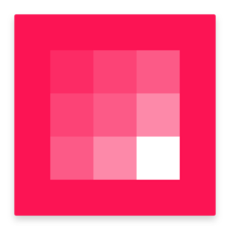

# <%= appId %>

[![Studio][studio-badge]][studio-link]
[![Version][version-badge]][homepage-link]
[![LICENSE][license-badge]](LICENSE)

> <%= description %>

## Setting up your environment

To install all the required dependencies locally and begin development use:

```
npm install
```

## Building and developing your app

There are two scripts available that will bundle and install your app:
`start` and `build`, described in detail below.

### Build output

Either build script will generate the following files.

| Output | Description |
| ------ | ----------- |
| `dist` | Your app distribution, including your application bundle, manifest, assets, etc... |
| `~/.invision-studio/apps/<%= appId %>` | Installation of your app via symlink to `dist`. |

### Development mode

```
npm run start
```

This will build and install your app in _development_ mode. Whenever you make
changes to your source files, it will automatically rebuild and reinstall your
app.

#### Automatically reloading apps

In addition to rebuilding and reinstalling the app, the development mode will
also automatically reload apps in Studio itself. Note that _all_ apps are
reloaded at once for a given InVision Studio editor window.

To setup automatic reloading of apps, you need to define the
`STUDIO_DEV_SERVER_PORT` environment variable with an available port number.
This will start Studio's development server, which enables app reloading,
whenever Studio is running. For example the following line could be added to
one of your initialization scripts to use 9101 as port number:

```
export STUDIO_DEV_SERVER_PORT=9101
```

> Note: Studio may need to be restarted to pick up the environment variable.

### Production mode

```
npm run build
```

This builds and installs your app in _production_ mode. This bundle is
minified to reduce file size. Changes made to your source will **NOT** be
automatically rebuilt.

## Submitting your app to the App Store

First you'll have to create a banner image for your app in the Studio App Store.
Add this image to your `assets` directory and indicate your banner in your
[`manifest.json`](manifest.json) file:

```
{
    [...]
    "banner": "assets/your-banner.png"
}
```

You may also wish to change the `dockIcon` in your manifest to an svg image of
your own creation, rather than a `"default"` provided by Studio.

```
{
    [...]
    "dockIcon": "assets/your-dock-icon.svg"
}
```

Then use Studio's command line interface to upload your app.

```
studio upload -f dist
```

[homepage-link]:        <%= homepage %>
[license-badge]:        https://img.shields.io/badge/license-<%= license %>-orange.svg
[studio-badge]:         https://img.shields.io/badge/studio-app-fd1455.svg
[studio-link]:          https://www.invisionapp.com/studio
[version-badge]:        https://img.shields.io/badge/version-v0.1.0-blue.svg
